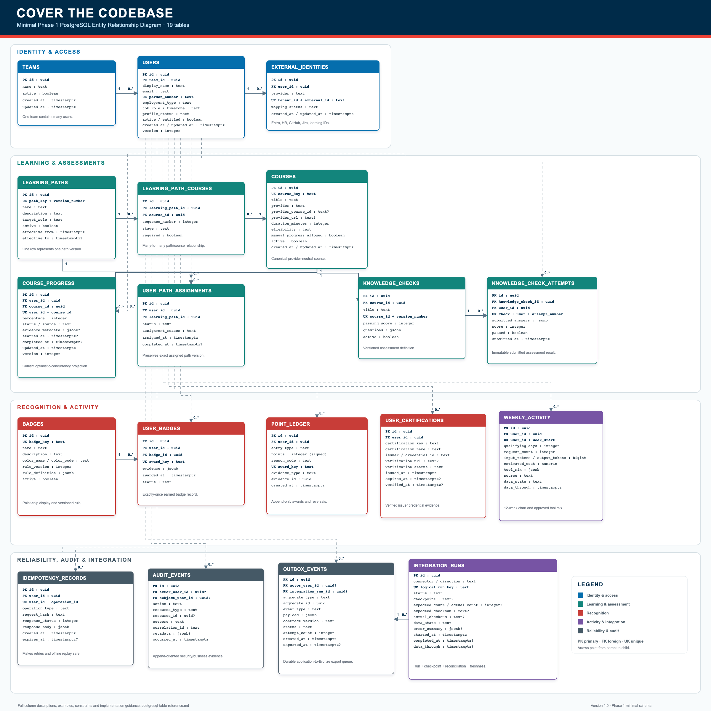

# Cover the Codebase — PostgreSQL ER Diagram

## Diagram image

The following image represents the approved minimal 19-table Phase 1 PostgreSQL schema.



[Open the PNG diagram](./assets/postgresql-er-diagram.png) · [Open the scalable SVG diagram](./assets/postgresql-er-diagram.svg)

## Reading the diagram

- `PK` means primary key.
- `FK` means foreign key.
- `UK` means a unique business key or unique constraint.
- `1` means exactly one parent record.
- `0..*` means zero or many child records.
- Blue tables contain identity and user information.
- Teal tables contain learning and assessment information.
- Red tables contain recognition information.
- Purple tables contain activity and integration information.
- Gray tables contain reliability and audit controls.

## Main relationships

```text
teams
  1 ─── 0..* users

users
  1 ─── 0..* external_identities
  1 ─── 0..* user_path_assignments
  1 ─── 0..* course_progress
  1 ─── 0..* knowledge_check_attempts
  1 ─── 0..* user_badges
  1 ─── 0..* point_ledger
  1 ─── 0..* user_certifications
  1 ─── 0..* weekly_activity
  1 ─── 0..* idempotency_records
  1 ─── 0..* audit_events
  1 ─── 0..* outbox_events

learning_paths
  1 ─── 0..* learning_path_courses
  1 ─── 0..* user_path_assignments

courses
  1 ─── 0..* learning_path_courses
  1 ─── 0..* course_progress
  1 ─── 0..* knowledge_checks

knowledge_checks
  1 ─── 0..* knowledge_check_attempts

badges
  1 ─── 0..* user_badges

integration_runs
  1 ─── 0..* outbox_events
```

## Relationship explanation

### Identity

- One team can contain many users.
- One user can have several external identities because Entra, HR, GitHub, Jira, and learning providers use different identifiers.

### Learning

- `learning_path_courses` resolves the many-to-many relationship between learning paths and courses.
- `user_path_assignments` records the exact versioned path assigned to a user.
- `course_progress` stores one current progress record per user and course.

### Assessments

- A course can have multiple versioned knowledge checks.
- Each knowledge check can have many attempts from different users.

### Recognition

- `user_badges` connects badge definitions to the users who earned them.
- `point_ledger` stores append-only awards, corrections, and reversals.
- `user_certifications` stores verified credentials held by each user.

### Activity

- `weekly_activity` stores one approved weekly aggregate per user.
- Team benchmarks are calculated by privacy-safe aggregation and do not require a separate table initially.

### Reliability and integrations

- `idempotency_records` prevents duplicate command execution.
- `audit_events` records important user and system actions.
- `outbox_events` preserves committed changes waiting for export.
- `integration_runs` records synchronization, checkpoint, reconciliation, and freshness status.

## Supporting documents

- `postgresql-er-schema.md` explains the reduced schema, relationships, constraints, omitted tables, and migration order.
- `postgresql-table-reference.md` explains every table and every column with examples.

The SVG is the maintained image source and can be zoomed without losing quality. The PNG is supplied for document tools that do not render SVG reliably.
