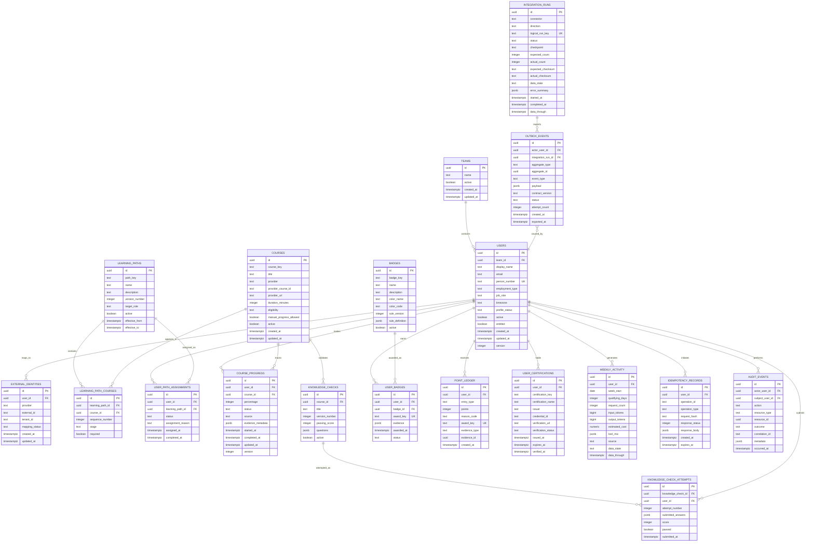

# Cover the Codebase — Minimal PostgreSQL ER Schema

## 1. Goal

This is the reduced PostgreSQL schema recommended for the Phase 1 application. It intentionally avoids creating every table discussed in the larger architecture plan.

The design contains **19 focused tables**. Each table supports a confirmed Phase 1 capability or an essential reliability control. Related concerns are consolidated when doing so does not compromise correctness or auditability.

This document is a schema design only. Database migrations should be created module by module rather than creating all tables before their features are implemented.

## 2. Design decisions

To keep the database small:

- HR profile, access entitlement, and eligibility fields are stored on `users`.
- Learning-path version information is stored on `learning_paths`; a separate version table is not used initially.
- Provider course mapping is stored on `courses`; a separate provider mapping table is not used initially.
- Manual-progress evidence is stored as bounded JSON metadata on `course_progress`.
- Knowledge-check questions are stored as versioned JSON on `knowledge_checks`.
- Submitted answers are stored as JSON on `knowledge_check_attempts`.
- Badge rules are stored as versioned JSON on `badges`.
- Certification catalog details are stored with `user_certifications`.
- Weekly activity and approved-tool mix are stored together in `weekly_activity`.
- Team benchmark values are calculated from eligible aggregate data rather than stored in a separate table initially.
- Data freshness, connector checkpoints, and reconciliation results are consolidated into `integration_runs`.
- Dashboard snapshots are not stored until performance testing proves they are needed.

## 3. ER diagram



## 4. Identity tables

### 4.1 `teams`

Purpose: stores the team to which a developer currently belongs.

Why it is required:

- Shows the developer's team on their profile.
- Allows privacy-safe team benchmark calculation.
- Provides a stable team key instead of repeatedly storing the team name.

Important rules:

- A team should normally be deactivated rather than deleted.
- Phase 1 does not expose a named team roster.

### 4.2 `users`

Purpose: stores the application's internal developer account and consolidated Phase 1 profile.

Why it is required:

- Every assignment, progress record, badge, point entry, certification, and activity record needs a stable internal user ID.
- Contains HR-derived employment type and role for eligibility decisions.
- Contains `active`, `entitled`, and `profile_status` for authorization.
- Supports `pending_profile` when mandatory HR fields are missing.

Important rules:

- `email` is display data and must not be the permanent identity key.
- `person_number` should be unique when supplied by HR.
- `version` supports optimistic concurrency for profile changes.
- Allowed `employment_type` values initially: `employee`, `contractor`.
- Allowed `profile_status` values initially: `active`, `pending_profile`, `inactive`.

Why profile and entitlement are included here:

Phase 1 requires only one current profile and one application entitlement result per user. Separate profile and entitlement tables would add joins without immediate value. They can be separated later if effective-dated entitlement history becomes necessary.

### 4.3 `external_identities`

Purpose: maps an internal user to Entra, HR, learning-provider, GitHub, Jira, gateway, and other provider identities.

Why it is required:

- Different systems use different identifiers for the same person.
- Email, name, and username can change.
- Activity must be attributed using explicit provider mappings.
- Ambiguous mappings can be marked `quarantined` rather than assigned to the wrong person.

Required unique constraint:

```text
(provider, tenant_id, external_id)
```

Suggested `mapping_status` values:

```text
confirmed
pending
quarantined
disabled
```

## 5. Learning tables

### 5.1 `learning_paths`

Purpose: stores versioned role-based learning paths.

Why it is required:

- Assigns the correct path to employees and contractors.
- Preserves the version assigned to a developer.
- Prevents later catalog changes from invalidating historical completion.

The table uses one row per path version. For example:

```text
ic-path / version 1
ic-path / version 2
lead-path / version 1
```

Required unique constraint:

```text
(path_key, version_number)
```

### 5.2 `courses`

Purpose: stores the application's canonical course catalog and the initial provider mapping.

Why it is required:

- Allows the application to display consistent course information.
- Records whether manual progress is allowed.
- Records employee/contractor eligibility.
- Connects provider progress to an internal course.

Suggested `eligibility` values:

```text
all
employee
contractor
```

A separate provider mapping table is not needed initially because Phase 1 expects one primary provider record per canonical course. Add a mapping table only if the same course must map to several provider records.

### 5.3 `learning_path_courses`

Purpose: connects courses to learning-path versions.

Why it is required:

- A path contains many courses.
- A course may appear in more than one path.
- Stores course order, badge stage, and required status.

Required unique constraints:

```text
(learning_path_id, course_id)
(learning_path_id, sequence_number)
```

### 5.4 `user_path_assignments`

Purpose: records which versioned path was assigned to a developer.

Why it is required:

- Role changes may create a new assignment.
- Historical assignments must remain visible.
- The system must know why and when a path was assigned.

Assignments should be closed or superseded, not deleted.

### 5.5 `course_progress`

Purpose: stores the user's current course progress.

Why it is required:

- Displays started, in-progress, and completed courses.
- Distinguishes manual progress from provider-confirmed progress.
- Stores bounded manual-evidence metadata.
- Supports concurrency conflicts with `version`.

Required unique constraint:

```text
(user_id, course_id)
```

Important rule:

A manual action must never downgrade provider-confirmed completion.

Why there is no separate progress-event table initially:

The current progress state is stored here, while meaningful changes are captured in `audit_events` and exported through `outbox_events`. Add an append-only progress-event table later only if detailed provider progress history becomes a confirmed reporting or compliance requirement.

## 6. Assessment tables

### 6.1 `knowledge_checks`

Purpose: defines a versioned course assessment.

Why it is required:

- Phase 1 requires knowledge checks.
- Stores the passing score and question definition.
- Preserves the exact assessment version taken by a user.

Questions are stored as structured JSON to avoid four or five tables for an initially small assessment system.

Example shape:

```json
[
  {
    "id": "q1",
    "type": "single_choice",
    "text": "Which data must not be stored?",
    "options": [
      { "id": "a", "text": "Course completion" },
      { "id": "b", "text": "Raw AI prompts" }
    ],
    "correctOptionIds": ["b"]
  }
]
```

Correct answers must not be returned to the browser before submission.

### 6.2 `knowledge_check_attempts`

Purpose: stores an assessment submission and its result.

Why it is required:

- Records score and pass/fail status.
- Supports multiple attempts.
- Provides evidence for points and badges.
- Preserves submitted answers for review and audit.

Required unique constraint:

```text
(knowledge_check_id, user_id, attempt_number)
```

## 7. Recognition tables

### 7.1 `badges`

Purpose: defines badges and their versioned award rules.

Why it is required:

- Stores Primer, First Coat, Cut In, Second Coat, Emerald, and Full Coverage definitions.
- Stores paint-chip display information.
- Holds the rule used by the asynchronous badge evaluator.

Rules are JSON because final badge definitions require client approval and may change.

### 7.2 `user_badges`

Purpose: records badges earned by each developer.

Why it is required:

- Shows the badge wall.
- Stores award time and supporting evidence.
- Prevents a retry from awarding the same badge twice.

Required unique constraints:

```text
award_key
(user_id, badge_id, award_key)
```

### 7.3 `point_ledger`

Purpose: stores every point award, reversal, and correction as a separate entry.

Why it is required:

- Provides an auditable explanation of the point total.
- Prevents silent total changes.
- Supports reversals without deleting history.
- Prevents duplicate points with `award_key`.

Example:

```text
+1,500  Primer badge
+3,000  GitHub certification
-1,500  Badge correction
```

Do not store only a mutable `total_points` column on `users`. The total should be calculated from the ledger or placed in a later read projection if performance requires it.

### 7.4 `user_certifications`

Purpose: stores verified certifications held by a developer.

Why it is required:

- Displays certification name and issuer.
- Stores verification status and credential reference.
- Supports expiration dates.
- Provides evidence for points and recognition.

A separate certification-catalog table is unnecessary until administrators need to manage a large reusable certification catalog.

## 8. Activity and dashboard table

### 8.1 `weekly_activity`

Purpose: stores one approved weekly activity summary per user.

Why it is required:

- Produces the 12-week activity chart.
- Determines qualifying active weeks.
- Displays approved-tool usage mix.
- Records tokens and estimated cost when approved.
- Communicates current, stale, partial, or unavailable data.

Required unique constraint:

```text
(user_id, week_start)
```

Example `tool_mix` value:

```json
[
  { "tool": "GitHub Copilot", "percentage": 42 },
  { "tool": "Claude", "percentage": 28 },
  { "tool": "Codex", "percentage": 18 },
  { "tool": "Other", "percentage": 12 }
]
```

Raw prompts must never be stored.

Team benchmarks can initially be calculated by aggregating eligible `weekly_activity` and learning data. The query must enforce the approved minimum cohort size.

## 9. Reliability and integration tables

### 9.1 `idempotency_records`

Purpose: prevents the same user operation from being applied more than once.

Why it is required:

- Browsers may retry requests.
- Users may double-click.
- Supported offline operations may replay.
- Duplicate progress must not create duplicate points or badges.

Required unique constraint:

```text
(user_id, operation_id)
```

### 9.2 `audit_events`

Purpose: stores append-oriented evidence of important actions.

Why it is required:

- Explains who changed progress and when.
- Records authorization failures and sensitive operations.
- Supports investigations and compliance.
- Preserves evidence even when current records change.

Audit records should not be edited or deleted through ordinary application workflows.

### 9.3 `outbox_events`

Purpose: safely queues committed application changes for Databricks export.

Why it is required:

- A user action must not be lost when Databricks is unavailable.
- The business update and outbox event can be written in one PostgreSQL transaction.
- The worker can retry exports later.

Example transaction:

```text
Update course_progress
Insert audit_event
Insert outbox_event
Commit all three together
```

The worker updates the outbox status only after receiving the expected adapter acknowledgement.

### 9.4 `integration_runs`

Purpose: records import/export runs, checkpoints, reconciliation, data freshness, and errors.

Why it is required:

- Prevents duplicate logical nightly runs.
- Shows whether data is current, stale, partial, or unavailable.
- Stores the checkpoint used for the next run.
- Records expected and actual counts/checksums.
- Provides operational evidence when synchronization fails.

Required unique constraint:

```text
logical_run_key
```

This single table replaces separate initial tables for sync runs, checkpoints, manifests, freshness, and reconciliation. Split them only if production volume or operational complexity proves necessary.

## 10. Tables intentionally omitted

The following previously discussed tables are not part of this minimal schema:

| Omitted table | Reason |
|---|---|
| `organizations` | No organization dashboard in Phase 1. |
| `user_profiles` | Current profile fields are consolidated into `users`. |
| `entitlements` | Current entitlement is consolidated into `users`. |
| `team_memberships` | Only current Phase 1 membership is stored on `users`; add history when period-effective membership becomes necessary. |
| `identity_mapping_quarantine` | Mapping state is stored on `external_identities`. |
| `learning_path_versions` | Each `learning_paths` row represents one version. |
| `course_versions` | Not needed until course configuration must be historically versioned independently. |
| `modules` | Stage is stored on `learning_path_courses`. |
| `course_eligibility_rules` | Simple eligibility is stored on `courses`. |
| `provider_courses` | Initial provider mapping is stored on `courses`. |
| `progress_events` | Current progress plus audit/outbox evidence is sufficient initially. |
| `manual_progress_evidence` | Bounded evidence metadata is stored on `course_progress`. |
| `knowledge_check_questions` | Questions are stored as versioned JSON. |
| `knowledge_check_options` | Options are stored inside the question JSON. |
| `knowledge_check_answers` | Answers are stored on the attempt. |
| `badge_rule_versions` | Rule version and definition are stored on `badges`. |
| `badge_evidence` | Evidence is stored on `user_badges`. |
| `certifications` | Certification definition is stored with the user's verified credential. |
| `personal_awards` | Optional and not required for the first implementation. |
| `tier_definitions` | Initial Sheen thresholds can be approved configuration; add a table only when runtime management is required. |
| `user_tier_projection` | Sheen tier can be calculated from approved configuration and ledger total. |
| `metric_definitions` | Initial metric definitions remain versioned code/configuration. |
| `tool_usage_facts` | Consolidated into `weekly_activity`. |
| `team_benchmark_aggregates` | Calculated by privacy-safe aggregation initially. |
| `dashboard_snapshots` | Add only if performance testing shows a need. |
| `data_freshness` | Consolidated into `weekly_activity` and `integration_runs`. |
| `sync_checkpoints` | Consolidated into `integration_runs`. |
| `inbound_manifests` | Consolidated into `integration_runs` initially. |
| `inbound_staging_records` | Add with the real Gold import when production payloads are known. |
| `quarantined_records` | Add when real connector error volume requires record-level remediation. |
| `reconciliation_results` | Consolidated into `integration_runs`. |
| `provider_events` | Add if provider event-level deduplication cannot use existing keys. |
| `configuration_versions` | Use reviewed versioned configuration until runtime configuration management is needed. |

## 11. Creation order

Do not create all 19 tables in one initial migration. Use this order.

### Migration 1 — Identity foundation

```text
teams
users
external_identities
audit_events
idempotency_records
```

This supports user projection, eligibility, authorization, and auditing.

### Migration 2 — Learning and progress

```text
learning_paths
courses
learning_path_courses
user_path_assignments
course_progress
outbox_events
```

This supports the first complete learning journey and reliable export evidence.

### Migration 3 — Assessments and recognition

```text
knowledge_checks
knowledge_check_attempts
badges
user_badges
point_ledger
user_certifications
```

This supports knowledge checks, points, badges, and certifications.

### Migration 4 — Activity and synchronization

```text
weekly_activity
integration_runs
```

This supports the 12-week dashboard, tool mix, data freshness, and synchronization operations.

## 12. Essential database constraints

The schema must enforce at least these constraints:

```text
users.person_number                         UNIQUE
external_identities(provider, tenant_id,
                    external_id)            UNIQUE
learning_paths(path_key, version_number)    UNIQUE
courses(course_key)                         UNIQUE
learning_path_courses(path, course)         UNIQUE
course_progress(user_id, course_id)         UNIQUE
knowledge_check_attempts(check, user,
                         attempt_number)     UNIQUE
badges(badge_key)                            UNIQUE
user_badges.award_key                       UNIQUE
point_ledger.award_key                      UNIQUE
weekly_activity(user_id, week_start)         UNIQUE
idempotency_records(user_id, operation_id)  UNIQUE
integration_runs.logical_run_key            UNIQUE
```

Additional checks:

```text
course_progress.percentage BETWEEN 0 AND 100
knowledge_check_attempts.score BETWEEN 0 AND 100
weekly_activity.qualifying_days BETWEEN 0 AND 7
point_ledger.points <> 0
```

## 13. Delete behavior

Recommended foreign-key behavior:

- Do not cascade-delete users, progress, points, badges, assessments, or audit evidence.
- Use inactive/status fields for business records that must remain historically visible.
- Allow cascade deletion only for unpublished test configuration where no user evidence exists.
- Restrict deletion when a referenced record has operational evidence.

## 14. Final recommendation

The 19-table design is the smallest practical schema that supports the complete Phase 1 individual journey, assessments, recognition, activity, privacy-aware benchmarking, idempotency, auditing, and Databricks export reliability.

For the first runnable database milestone, create only the **11 tables in Migrations 1 and 2**. Add the remaining eight tables when assessment, recognition, activity, and synchronization modules are implemented.

Do not add an omitted table merely because it appeared in an earlier proposal. Add it only when a confirmed requirement, real provider contract, or measured performance/operational need justifies it.
